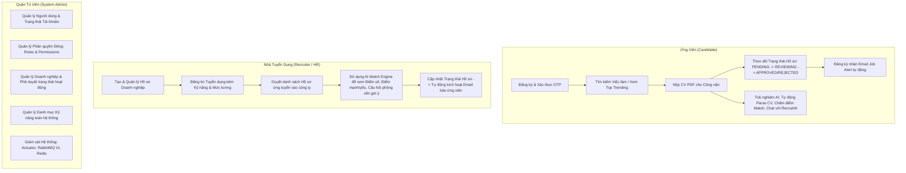
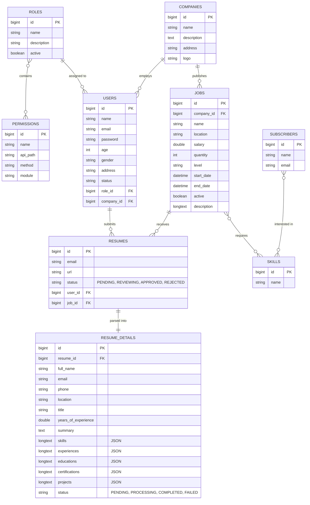

# 🌐 HỆ THỐNG TUYỂN DỤNG THÔNG MINH - RECRUITMENT WEB SYSTEM
> **Enterprise Recruitment Platform powered by Spring Boot 3, Event-Driven Architecture (RabbitMQ), In-Memory Caching (Redis), and Generative AI (Spring AI & Google Gemini).**

[](https://spring.io/projects/spring-boot)
[](https://www.oracle.com/java/)
[](https://spring.io/projects/spring-ai)
[](https://www.rabbitmq.com/)
[](https://redis.io/)
[](https://www.mysql.com/)
[](https://www.docker.com/)
[](http://localhost:8080/swagger-ui/index.html)

---

## 📑 MỤC LỤC TỔNG QUAN

1. [Giới Thiệu Tổng Quan Dự Án](#1-giới-thiệu-tổng-quan-dự-án)
2. [Các Đối Tượng Người Dùng & Luồng Nghiệp Vụ Toàn Trình](#2-các-đối-tượng-người-dùng--luồng-nghiệp-vụ-toàn-trình)
3. [Chi Tiết 10 Phân Hệ Nghiệp Vụ Cốt Lõi](#3-chi-tiết-10-phân-hệ-nghiệp-vụ-cốt-lõi)
   - 3.1. Phân hệ Xác thực & Bảo mật (Authentication & Authorization)
   - 3.2. Phân hệ Phân quyền Động (Permission-Based Access Control - PBAC)
   - 3.3. Phân hệ Quản trị Người dùng (User Management)
   - 3.4. Phân hệ Doanh nghiệp & Nhà tuyển dụng (Company Management)
   - 3.5. Phân hệ Quản lý Tin Tuyển Dụng & Bảng Xếp Hạng Xu Hướng (Job Management & Real-time Leaderboard)
   - 3.6. Phân hệ Danh mục Kỹ năng (Skill Taxonomy)
   - 3.7. Phân hệ Quản lý Hồ sơ Ứng tuyển (Resume Application Lifecycle)
   - 3.8. Phân hệ Đăng ký & Nhận Bản tin Việc làm (Job Alert Subscription)
   - 3.9. Phân hệ Xử lý Bất đồng bộ & Hướng sự kiện (RabbitMQ Event-Driven Pipeline)
   - 3.10. Phân hệ Trí tuệ Nhân tạo Đột phá (Spring AI & Gemini Ecosystem)
4. [Sơ Đồ Kiến Trúc Hệ Thống (System Architecture)](#4-sơ-đồ-kiến-trúc-hệ-thống-system-architecture)
5. [Mô Hình Dữ Liệu (Database Schema & ERD)](#5-mô-hình-dữ-liệu-database-schema--erd)
6. [Thiết Kế API Chuẩn Hóa & Quản Lý Ngoại Lệ Tập Trung](#6-thiết-kế-api-chuẩn-hóa--quản-lý-ngoại-lệ-tập-trung)
7. [Cấu Trúc Thư Mục Source Code](#7-cấu-trúc-thư-mục-source-code)
8. [Hướng Dẫn Cài Đặt & Khởi Chạy (Getting Started)](#8-hướng-dẫn-cài-đặt--khởi-chạy-getting-started)
9. [Tài Liệu API Trực Quan (Swagger OpenAPI)](#9-tài-liệu-api-trực-quan-swagger-openapi)
10. [Thông Tin Tác Giả & Liên Hệ (Author Information)](#10-thông-tin-tác-giả--liên-hệ-author-information)

---

# 1. GIỚI THIỆU TỔNG QUAN DỰ ÁN

**RecruitmentWeb** là một hệ thống tuyển dụng trực tuyến toàn diện (Full-lifecycle Recruitment Platform), được xây dựng để kết nối hàng triệu ứng viên với các doanh nghiệp tuyển dụng hàng đầu.

Dự án không dừng lại ở mức ứng dụng CRUD cơ bản, mà được thiết kế theo tiêu chuẩn của các nền tảng tuyển dụng quy mô lớn (như TopCV, VietnamWorks, LinkedIn), giải quyết triệt để 4 thách thức kỹ thuật cốt lõi:
1. **Hiệu năng & Khả năng mở rộng (High Performance & Scalability):** Giảm tải 80% truy vấn cơ sở dữ liệu nhờ chiến lược **Cache-Aside** và xây dựng bảng xếp hạng thời gian thực bằng **Redis Sorted Sets (ZSet)**.
2. **Độ tin cậy xử lý giao dịch (Message Reliability):** Sử dụng **RabbitMQ** với cơ chế **Manual ACK** và **Dead Letter Queue (DLQ)** để xử lý email và sự kiện ngầm, đảm bảo API phản hồi tức thì (~20ms) và không bao giờ mất mát thông điệp.
3. **Bảo mật chuyên sâu (Enterprise Security):** Áp dụng **PBAC** (Permission-Based Access Control) kết hợp **Custom Security Expressions** và lưu trữ JWT trong **HttpOnly Cookie**, triệt tiêu rủi ro tấn công XSS/CSRF.
4. **Ứng dụng AI thực chiến (Applied Generative AI):** Tích hợp **Google Gemini 1.5 Flash Multimodal** và **Spring AI** để tự động bóc tách PDF CV thành dữ liệu JSON, chấm điểm so khớp CV - JD với cơ chế Redis Cache (TTL 24h), Trợ lý ảo Function Calling tra cứu trực tiếp MySQL và tìm kiếm việc làm theo ngữ nghĩa (Semantic Vector Search).

---

# 2. CÁC ĐỐI TƯỢNG NGƯỜI DÙNG & LUỒNG NGHIỆP VỤ TOÀN TRÌNH

Hệ thống phân định ranh giới rõ ràng giữa 3 nhóm đối tượng:



---

# 3. CHI TIẾT 10 PHÂN HỆ NGHIỆP VỤ CỐT LÕI

### 3.1. Phân hệ Xác thực & Bảo mật (Authentication & Authorization)
- **Đăng ký & Kích hoạt tài khoản:** Đăng ký tài khoản mới $\rightarrow$ Hệ thống tự động sinh mã OTP ngẫu nhiên $\rightarrow$ Đẩy sự kiện qua RabbitMQ để gửi email kích hoạt.
- **Xác thực JWT Token kép:** Cấp phát cặp Access Token (ngắn hạn) và Refresh Token (dài hạn).
- **Phòng chống tấn công XSS:** Lưu trữ Refresh Token trong **HttpOnly Cookie**, không thể truy cập từ mã JavaScript phía Client.
- **Cơ chế Đăng xuất An toàn (Token Blacklist):** Khi người dùng Logout, Access Token hiện tại được lưu vào **Redis Blacklist** với TTL bằng thời gian sống còn lại của token, ngăn chặn việc tái sử dụng token đã bị thu hồi.
- **Quên & Đặt lại Mật khẩu:** Gửi đường dẫn / mã xác nhận OTP qua email bất đồng bộ để khôi phục tài khoản an toàn.

### 3.2. Phân hệ Phân quyền Động (Permission-Based Access Control - PBAC)
- Thay vì phân quyền cứng theo Role (như `ROLE_ADMIN`, `ROLE_USER`), hệ thống phân quyền chi tiết tới từng hành động nghiệp vụ (**Permissions**):
  - Mỗi Permission đại diện cho một API cụ thể: `apiPath` (ví dụ `/api/v1/jobs`), `method` (`POST`), `module` (`JOBS`).
  - Gán Permission vào các Role (`SUPER_ADMIN`, `HR`, `CANDIDATE`).
- **Kiểm soát bảo mật tầng Method:** Sử dụng annotation `@PreAuthorize(SecurityConstant.JOB_CREATE)` trên từng endpoint của Controller.
- **Custom Security Expressions:** Kiểm tra logic sở hữu (Ownership Verification) – đảm bảo HR của Công ty A không thể sửa hay xóa tin tuyển dụng của Công ty B.

### 3.3. Phân hệ Quản trị Người dùng (User Management)
- Quản lý thông tin chi tiết: Họ tên, Email, Tuổi, Giới tính (`GenderEnum`), Địa chỉ, Công ty trực thuộc.
- Trạng thái tài khoản (`UserStatusEnum`): `ACTIVE`, `INACTIVE`, `PENDING_VERIFY`.
- Tìm kiếm, lọc động người dùng với Spring Data JPA Specifications kết hợp phân trang (`Pageable`).

### 3.4. Phân hệ Doanh nghiệp & Nhà tuyển dụng (Company Management)
- Tạo và chỉnh sửa hồ sơ công ty: Tên, địa chỉ, mô tả giới thiệu quy mô công ty.
- Tích hợp **Cloudinary SDK** để upload và quản lý logo thương hiệu trên CDN đám mây.
- Quản lý danh sách nhân sự (HR) thuộc biên chế công ty.
- Quản lý trạng thái công ty (`CompanyStatusEnum`): `ACTIVE`, `INACTIVE`.

### 3.5. Phân hệ Quản lý Tin Tuyển Dụng & Bảng Xếp Hạng Xu Hướng (Job Management & Real-time Leaderboard)
- **Đăng tin & Cập nhật Job:** Tiêu đề, Mức lương, Địa điểm, Số lượng tuyển, Mô tả chi tiết, Ngày bắt đầu và Ngày hết hạn.
- **Phân loại Cấp bậc (`LevelEnum`):** `INTERN`, `FRESHER`, `JUNIOR`, `MIDDLE`, `SENIOR`.
- **Gắn nhãn Kỹ năng:** Liên kết công việc với danh mục các kỹ năng chuyên môn bắt buộc (Many-to-Many với `Skill`).
- **Lọc động nâng cao (Advanced Dynamic Filter):** Tích hợp thư viện `turkraft-springfilter` cho phép client lọc linh hoạt theo mọi tiêu chí (khoảng lương, địa điểm, kỹ năng, cấp bậc) trực tiếp qua query params.
- **Bảng Xếp Hạng Việc Làm Xu Hướng (Top Trending Jobs Leaderboard):**
  - Sử dụng **Redis Sorted Sets (ZSet)**: Mỗi lượt xem tin tuyển dụng sẽ tự động tăng điểm số (`ZINCRBY job_trending 1 jobId`).
  - Thuật toán giảm điểm theo thời gian (**Nightly Score-Decay Algorithm**): Chạy ngầm qua **Spring Scheduler** lúc nửa đêm, nhân điểm số của tất cả các job với hệ số phân rã ($Score \times 0.95$) để ưu tiên các công việc mới nổi bật hơn các công việc cũ.

### 3.6. Phân hệ Danh mục Kỹ năng (Skill Taxonomy)
- Quản lý kho kỹ năng công nghệ (Java, Spring Boot, ReactJS, Python, AWS, Docker...).
- Tự động gợi ý kỹ năng khi HR đăng tuyển hoặc khi ứng viên tạo hồ sơ.
- Làm cầu nối liên kết giữa yêu cầu công việc (`Job`) và năng lực của ứng viên (`ResumeDetail`).

### 3.7. Phân hệ Quản lý Hồ sơ & Ứng tuyển (Resume Application Lifecycle)
- **Nộp hồ sơ ứng tuyển:** Ứng viên tải file PDF CV trực tiếp lên Cloudinary CDN và gắn vào Job mong muốn.
- **Vòng đời trạng thái ứng tuyển (`ResumeStatusEnum`):**
  $$\text{PENDING (Chờ duyệt)} \longrightarrow \text{REVIEWING (Đang xem xét)} \longrightarrow \text{APPROVED (Phê duyệt phỏng vấn)} \text{ hoặc } \text{REJECTED (Từ chối)}$$
- Mỗi khi HR cập nhật trạng thái hồ sơ, hệ thống tự động đẩy sự kiện gửi email thông báo kết quả cho ứng viên thông qua RabbitMQ.

### 3.8. Phân hệ Đăng ký & Nhận Bản tin Việc làm (Job Alert Subscription)
- Ứng viên đăng ký nhận tin việc làm tự động theo các kỹ năng yêu thích (`Subscriber`).
- Định kỳ hàng ngày (8:00 sáng), **Spring Scheduler** quét toàn bộ việc làm mới đăng trong 24 giờ qua.
- Sử dụng mô hình **RabbitMQ Fanout Exchange** để phát tán email tổng hợp danh sách việc làm (Job Alert Digest) tới hàng nghìn ứng viên song song.

### 3.9. Phân hệ Xử lý Bất đồng bộ & Hướng sự kiện (RabbitMQ Event-Driven Pipeline)
- **Tách rời luồng xử lý (Decoupling):** HTTP Request trả về ngay cho người dùng, các tác vụ nặng được đẩy sang hàng đợi.
- **Direct Exchange (`recruitment.direct.exchange`):** Định tuyến chính xác email xác nhận, OTP, thông báo hồ sơ.
- **Cơ chế Manual ACK:** Consumer chỉ xác nhận hoàn thành khi email đã thực sự được gửi thành công.
- **Dead Letter Queue (DLQ):** Khi gặp sự cố mạng hoặc lỗi SMTP, message tự động thử lại tối đa 3 lần. Nếu vẫn thất bại, message được chuyển an toàn sang `recruitment.email.dlq` để bảo toàn dữ liệu.
- **Fanout Exchange (`job-alert.fanout`):** Nhân bản và phát tán tin tuyển dụng hàng loạt cho nhiều hàng đợi mà không cần routing key.

### 3.10. Phân hệ Trí tuệ Nhân tạo Đột phá (Spring AI & Gemini Ecosystem)
- **Bóc tách CV Đa phương thức (Multimodal CV Parsing):** Gemini 1.5 Flash đọc trực tiếp PDF CV từ Cloudinary, phân tích cả ngữ nghĩa và bố cục thị giác, bóc tách ra bảng `ResumeDetail` với các trường JSON sạch: Kỹ năng, Kinh nghiệm làm việc, Học vấn, Dự án, Chứng chỉ.
- **Động cơ Chấm điểm So khớp (AI Job Match Score Engine):**
  - So sánh chi tiết dữ liệu ứng viên (`ResumeDetail`) với yêu cầu tuyển dụng (`Job`).
  - Đánh giá theo thang điểm 100 với trọng số khoa học: Kỹ năng chuyên môn (40%), Kinh nghiệm thực tế (35%), Học vấn/Chứng chỉ (15%), Kỹ năng mềm (10%).
  - Trả về JSON có cấu trúc gồm: Điểm tổng, Mức độ phù hợp (`HIGH`, `MEDIUM`, `LOW`), Điểm mạnh, Điểm yếu, Kỹ năng còn thiếu, và Đề xuất câu hỏi phỏng vấn cho HR.
  - **Tích hợp Redis Caching (TTL 24h):** Lần truy vấn thứ 2 trả về ngay lập tức (~5ms), tiết kiệm 100% chi phí token.
- **Trợ lý ảo Tuyển dụng (RecruitAI Chatbot with Function Calling):**
  - Chatbot hỗ trợ ứng viên tra cứu cơ hội việc làm bằng ngôn ngữ tự nhiên.
  - Cơ chế **Function Calling**: Gemini tự động phát hiện ý định và gọi các hàm backend của Spring Boot (`searchJobsFunction`, `getJobDetailFunction`) để lấy dữ liệu thực tế từ MySQL trả lời người dùng, triệt tiêu hoàn toàn hiện tượng bịa đặt thông tin (Hallucination).
- **Tìm kiếm Việc làm theo Ngữ nghĩa (Semantic Vector Search):**
  - Sử dụng Embeddings biến đổi mô tả công việc thành các vector ngữ nghĩa lưu trong Vector Store.
  - Tìm kiếm việc làm dựa trên độ tương đồng Cosine (Cosine Similarity), hiểu được các từ đồng nghĩa mà SQL `LIKE` truyền thống bỏ sót.
- **Hệ thống Gợi ý Việc làm 2 Giai đoạn (Two-Stage Recommendation):**
  - **Giai đoạn 1 (Lọc nhanh):** Vector Search quét nhanh Top 10 công việc có độ tương đồng cao nhất.
  - **Giai đoạn 2 (Tái xếp hạng sâu):** Đưa Top 10 qua Gemini LLM để chấm điểm chi tiết và chọn ra những công việc phù hợp nhất.

---

# 4. SƠ ĐỒ KIẾN TRÚC HỆ THỐNG (SYSTEM ARCHITECTURE)

```mermaid
graph TD
    Client[Web Browser / Mobile Client / Postman] -->|HTTP RESTful APIs| Gateway[Spring Boot Backend :8080]

    subgraph "Core Backend Layer"
        Gateway --> Security[Spring Security & JWT + PBAC]
        Security --> Controllers[REST Controllers]
        Controllers --> Services[Business Services]
        Services --> JPA[Spring Data JPA / Specifications]
    end

    subgraph "Data & Caching Layer"
        JPA --> MySQL[(MySQL 8.0 :3307)]
        Services -->|Cache-Aside / ZSet / Blacklist| Redis[(Redis Alpine :6379)]
    end

    subgraph "Event-Driven & Async Layer"
        Services -->|Publish Events| RabbitMQ[RabbitMQ Broker :5672]
        RabbitMQ -->|Direct Exchange| EmailQ[recruitment.email.queue]
        RabbitMQ -->|Fanout Exchange| AlertQ[job-alert.email.queue]
        RabbitMQ -->|Async Event| ParseQ[cv.parsing.queue]
        
        EmailQ -->|Manual ACK| Worker1[Email Consumer]
        AlertQ -->|Concurrency Pool: 5| Worker2[Batch Alert Consumer]
        ParseQ -->|Download PDF| Worker3[CV Parsing Consumer]
        
        EmailQ -.->|NACK x3 / Fail| DLQ[Dead Letter Queue (DLQ)]
    end

    subgraph "AI & External Cloud Services"
        Worker3 -->|Byte Array Resource| Gemini[Google Gemini 1.5 Flash]
        Services -->|Structured Output / Function Calling| Gemini
        Services -->|Vector Embeddings| VectorStore[Spring AI SimpleVectorStore]
        Controllers -->|Upload Media| Cloudinary[Cloudinary Cloud Storage]
        Worker1 -->|Send Mail| MailServer[Google SMTP Server]
    end
```

---

# 5. MÔ HÌNH DỮ LIỆU (DATABASE SCHEMA & ERD)



---

# 6. THIẾT KẾ API CHUẨN HÓA & QUẢN LÝ NGOẠI LỆ TẬP TRUNG

### 1. Chuẩn hóa Định dạng Phản hồi (`ResponseData<T>`)
Tất cả các REST API đều trả về một định dạng JSON thống nhất thông qua lớp `ResponseData<T>`:
```json
{
  "status": 200,
  "message": "Get Success",
  "data": { ... }
}
```
- Sử dụng enum **`SuccessCode`** (`GET_SUCCESS`, `CREATED_SUCCESS`, `PUT_SUCCESS`, `DELETE_SUCCESS`...) đảm bảo tính nhất quán trên toàn bộ ứng dụng.

### 2. Quản lý Ngoại lệ Tập trung (`GlobalExceptionHandler`)
Toàn bộ lỗi nghiệp vụ và lỗi hệ thống đều được bắt và xử lý tập trung bằng `@RestControllerAdvice`:
- **Lỗi nghiệp vụ (`AppException`):** Ánh xạ trực tiếp sang `ErrorCode` với mã HTTP Status và thông báo lỗi rõ ràng.
- **Lỗi xác thực dữ liệu đầu vào (`MethodArgumentNotValidException`):** Tự động bóc tách danh sách các trường vi phạm validation (@NotBlank, @Min, @Email...) trả về mảng chi tiết cho Client.
- **Lỗi bảo mật:** Bắt và chuẩn hóa `AccessDeniedException` (403), `BadCredentialsException` (400), `MaxUploadSizeExceededException` (400).

---

# 7. CẤU TRÚC THƯ MỤC SOURCE CODE

Dự án áp dụng phong cách thiết kế phân tầng chuẩn mực kết hợp với các Sub-domain chuyên biệt (`messaging`, `ai`):

```text
com.caochung.recruitment
├── config                         # Cấu hình hệ thống (Security, Redis, RabbitMQ, Spring AI)
│   ├── CloudinaryConfig.java
│   ├── CorsConfig.java
│   ├── OpenApiConfig.java
│   ├── RabbitMQConfig.java
│   ├── RedisConfig.java
│   ├── SecurityConfiguration.java
│   └── SpringAiConfig.java
├── constant                       # Các hằng số, Enum trạng thái, mã lỗi và mã thành công
│   ├── ErrorCode.java
│   ├── LevelEnum.java
│   ├── PermissionEnum.java
│   ├── ResumeStatusEnum.java
│   ├── SecurityConstant.java
│   └── SuccessCode.java
├── controller                     # Tầng tiếp nhận HTTP REST API (Job, Resume, Auth, AI...)
│   ├── AiController.java
│   ├── AuthController.java
│   ├── CloudinaryController.java
│   ├── CompanyController.java
│   ├── JobController.java
│   ├── PermissionController.java
│   ├── ResumeController.java
│   ├── RoleController.java
│   ├── SkillController.java
│   ├── SubscriberController.java
│   └── UserController.java
├── domain                         # Các thực thể JPA (JPA Entities)
│   ├── Company.java
│   ├── Job.java
│   ├── Permission.java
│   ├── Resume.java
│   ├── ResumeDetail.java
│   ├── Role.java
│   ├── Skill.java
│   ├── Subscriber.java
│   └── User.java
├── dto                            # Data Transfer Objects (Request / Response)
│   ├── request/
│   └── response/
│       └── ResponseData.java      # Chuẩn bọc phản hồi thống nhất { status, message, data }
├── exception                      # Quản lý lỗi tập trung (@RestControllerAdvice)
│   ├── AppException.java
│   └── GlobalExceptionHandler.java
├── messaging                      # Module hướng sự kiện (RabbitMQ)
│   ├── consumer/                  # Các Consumer lắng nghe Queue (Manual ACK, DLQ)
│   │   ├── CvParsingConsumer.java
│   │   ├── EmailNotificationConsumer.java
│   │   └── JobAlertConsumer.java
│   └── publisher/                 # Các Publisher phát tán sự kiện
│       ├── NotificationPublisher.java
│       ├── RabbitMQCvParsingPublisher.java
│       ├── RabbitMQJobAlertPublisher.java
│       └── RabbitMQNotificationPublisher.java
├── repository                     # Tầng truy vấn cơ sở dữ liệu (Spring Data JPA)
├── scheduler                      # Tác vụ định kỳ (Quét Job mới, Decay Trending Leaderboard)
│   ├── JobAlertScheduler.java
│   └── TrendingJobScheduler.java
├── service                        # Tầng nghiệp vụ cốt lõi (Business Logic & MapStruct)
│   ├── impl/
│   └── mapper/
└── ai                             # AI Domain Core (Xử lý Prompts, Vector Store & Tools)
    ├── dto/                       # AI DTOs (JobMatchResultDTO, ParsedCvDTO, Tool Requests)
    │   └── tool/
    └── service/                   # AI Core Services
        ├── AiChatbotService.java
        ├── CvParsingService.java
        ├── JobMatchingService.java
        ├── RecommendationService.java
        ├── SemanticSearchService.java
        └── impl/
```

---

# 8. HƯỚNG DẪN CÀI ĐẶT & KHỞI CHẠY (GETTING STARTED)

### 1. Yêu Cầu Môi Trường (Prerequisites)
- **Java Development Kit (JDK):** Version 17 trở lên.
- **Docker & Docker Compose:** Để khởi chạy MySQL, Redis, RabbitMQ.
- **Google Gemini API Key:** Lấy miễn phí tại [Google AI Studio](https://aistudio.google.com/).

---

### 2. Khởi Động Hạ Tầng Bằng Docker Compose
Mở terminal tại thư mục gốc của dự án và chạy:

```bash
docker compose up -d
```

Lệnh trên sẽ khởi động 3 container ngầm:
- **MySQL 8.0:** Port `3307` (Username: `root`, Password: `123456`, Database: `recruitment`).
- **Redis Alpine:** Port `6379`.
- **RabbitMQ 3.13:** AMQP Port `5672`, Management UI Port `15672` (User/Pass: `admin` / `admin123`).

---

### 3. Cấu Hình Biến Môi Trường (Environment Variables)
Cấu hình trong file `src/main/resources/application-dev.yml` hoặc tạo file `.env`:

```properties
# Google Gemini API
GEMINI_API_KEY=AIzaSyYourGeminiApiKeyHere...

# Cloudinary Media Storage
CLOUDINARY_CLOUD_NAME=your_cloud_name
CLOUDINARY_API_KEY=your_api_key
CLOUDINARY_API_SECRET=your_api_secret

# JWT Secret Key
CAOCHUNG_JWT_SECRET=dGhpc2lzYXZlcnlzZWNyZXRrZXlmb3Jqd3RhdXRoZW50aWNhdGlvbjEyMzQ1Njc4OTA=
```

---

### 4. Khởi Chạy Ứng Dụng (Run Application)

Sử dụng Gradle Wrapper đi kèm dự án:

```bash
# Trên Windows (PowerShell / CMD):
./gradlew bootRun

# Trên Linux / macOS:
./gradlew bootRun
```

Ứng dụng Backend sẽ khởi động thành công tại: `http://localhost:8080`.

---

# 9. TÀI LIỆU API TRỰC QUAN (SWAGGER OPENAPI)

Toàn bộ tài liệu API tương tác trực quan được cung cấp qua Swagger UI tại:

👉 **URL:** [http://localhost:8080/swagger-ui/index.html](http://localhost:8080/swagger-ui/index.html)

### Danh mục các nhóm API chính:
1. **Module Auth (`/api/v1/auth/**`):** Đăng ký, Đăng nhập, Làm mới Token, Kích hoạt OTP, Quên mật khẩu.
2. **Module User (`/api/v1/users/**`):** CRUD người dùng, phân trang, lọc nâng cao.
3. **Module Company (`/api/v1/companies/**`):** CRUD công ty, upload logo thương hiệu.
4. **Module Job (`/api/v1/jobs/**`):** CRUD tin tuyển dụng, Top 10 việc làm xu hướng, lọc theo kỹ năng và địa điểm.
5. **Module Resume (`/api/v1/resumes/**`):** Nộp CV, cập nhật trạng thái hồ sơ ứng viên.
6. **Module Skill (`/api/v1/skills/**`):** Quản lý danh mục kỹ năng chuyên môn.
7. **Module Permission & Role (`/api/v1/permissions/**`, `/api/v1/roles/**`):** Quản lý ma trận phân quyền hệ thống.
8. **Module AI & Smart Recruitment (`/api/v1/ai/**`):**
   - `GET /api/v1/ai/match-score`: Chấm điểm so khớp CV và JD (có Redis Cache).
   - `POST /api/v1/ai/chat`: Hội thoại cùng trợ lý ảo RecruitAI với Function Calling.
   - `POST /api/v1/ai/index-jobs`: Tạo Embeddings và đồng bộ toàn bộ Job vào Vector Store.
   - `GET /api/v1/ai/semantic-search`: Tìm kiếm việc làm theo ngữ nghĩa tự nhiên.
   - `GET /api/v1/ai/recommendations`: Gợi ý việc làm phù hợp cho ứng viên qua mô hình Two-Stage.

---

# 10. THÔNG TIN TÁC GIẢ & LIÊN HỆ (AUTHOR INFORMATION)

- **Họ và tên:** Bùi Cao Chung
- **Vị trí chuyên môn:** Backend Developer (Java / Spring Boot / Event-Driven / AI Engineering)
- **Email:** [bcc1112005@gmail.com](mailto:bcc1112005@gmail.com)
- **GitHub Cá nhân:** [github.com/CaoChung111](https://github.com/CaoChung111)
- **GitHub Repository:** [github.com/CaoChung111/RecruitmentWeb](https://github.com/CaoChung111/RecruitmentWeb)

---
*Dự án được xây dựng với mục tiêu đạt chuẩn Production-Ready, tuân thủ các nguyên lý thiết kế SOLID, Clean Architecture và áp dụng các công nghệ hiện đại nhất trong hệ sinh thái Java & AI.*
